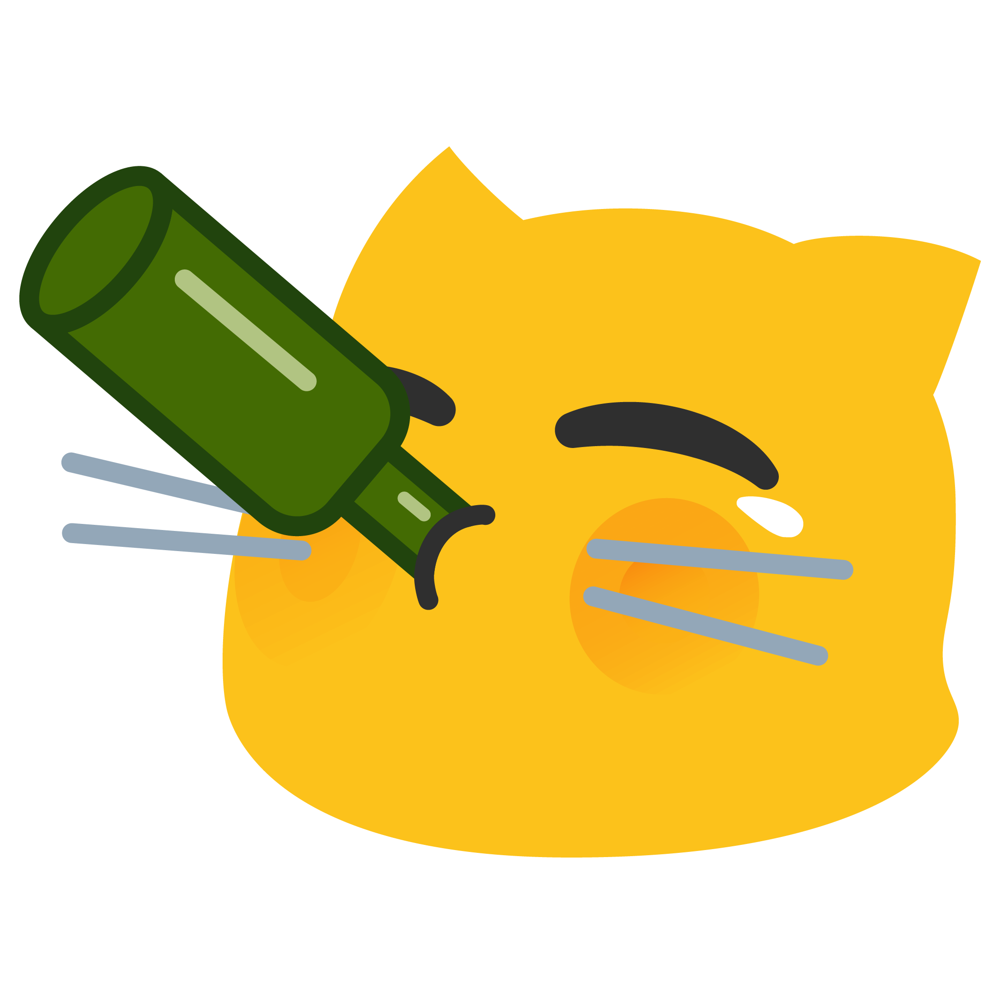

# O5 Archive
An archive of what I had during the course (no big thing but worth archiving).

```                                                                    
  . = -         . :                      
. * % % = .   . : - : : : : : . . . .    
= % @ @ % + . : - - - - - - - - - - - : .
+ @ @ % # # * = - - - - - - - - - - - - .
. + % @ % # % # + = - - - - - - - - - :  
  . + % @ % % @ @ + - = * # * = - - - :  
  . : = % @ @ @ % = - = * * # # = - - -  
  . . : + % @ @ % # = - - = = = - - - - .
  . . : : + * * % * = - = = = = - - - - .
        . - = = + = - - = = = = - - - -  
        . - - - - - - - = = = = = - - :  
        . - - - - - - - - - - - - - - -  
          : - - - - - - - - - - - - - :  
          . : - - - - - - - - - - - : .  
              . : : - - - - : : : .                
```                                    
> Plan to get drunk.     



                                                                       
                                                                       
